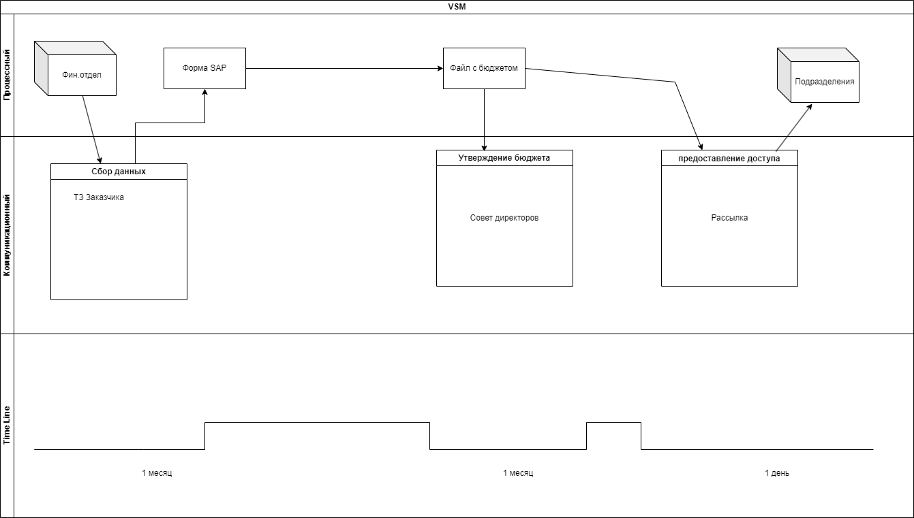

# Задача на примере программирования с ТЗ от заказчиков 

Проанализируйте свою повседневную работу или работу отдела в вашей компании на наличие потерь.
Нарисуйте VSM-карту.

Найдите потери и классифицируйте их в соответствии с материалом лекции.

Подумайте, как исключить эти потери.

Нарисуйте новую VSM-карту в соответствии с вашими предложениями. Вы можете использовать все рекомендованные на семинаре программы для рисования VSM-карты. В качестве выполненного задания приложите скрин или PDF-файл с VSM-картой и ответом на вопросы.

## Решение

* Возможные потери по категориям:

1. Транспортировка - неумение заказчика пользоваться гитом, придётся объянснять, как он может посмотреть готовый код/версии

2. Изляшняя обработка - функции парсера похожи по коду, возможно разработчик пропишет один процесс несколько раз

3. Движение - нет

4. Ожидание - ожидание ответа от менеджера в промежутках между написание кода

5. Перепроизводство - нет

6. Запасы - нет

7. Дефекты - дефекты кода, некачественный парсинг/не происходит запись в базу данных

8. Неиспользованный потенциал - нет

*  *Решения:*

1.   Использовать другой сервис для сдачи проекта/его версий

2. Детальнее прописать алгоритм программы, чтобы исключить повторение одних и тех же процессов

3. Сменить менеджера с: / сменить платформу для общения, где он сможет быстрее отвечать

4. Детальнее прописать агоритм, ещё раз сверится с тз (менять кодера мы не можем, потому что этот кодер - мы)

# VSM-картa:
